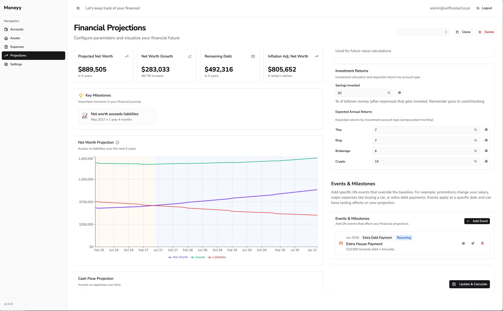

# 💰 Moneyy - Take Control of Your Finances

**Your financial data belongs to you. Host it yourself.**



Money is a modern, self-hosted personal finance management platform that gives you complete control over your financial data. No third-party services, no data selling, no privacy concerns—just you and your money.

## Why Moneyy?

**Privacy First** - Your financial data never leaves your server. No third parties, no tracking, no compromises.

**Complete Control** - Own your data, customize everything, and keep your financial information secure on your own terms.

**Free Forever** - No subscriptions, no premium tiers, no hidden costs. Deploy once and use forever.

**Open Source** - Transparent codebase you can audit, modify, and trust.

## Features

- **Account Management** - Create and track all your financial accounts with balance history charts and multi-currency support (CAD, USD, INR)
- **Mortgage Tracking** - Setup mortgages, record payments, view amortization schedules, and track extra payments
- **Loan Management** - Track personal loans with payment schedules and interest calculations
- **Asset Tracking** - Monitor real estate, vehicles, collectibles, and equipment with automatic or manual depreciation
- **Recurring Expenses** - Manage weekly to annual recurring expenses with categorization (housing, utilities, transportation, and more)
- **Financial Projections** - Advanced forecasting with tax brackets, inflation rates, salary growth, and investment returns across TFSA, RRSP, and brokerage accounts
- **Data Integrations** - Connect your Wealthsimple account for automatic syncing (Plaid, Stripe, PayPal coming soon)
- **Multi-Currency** - Automatic exchange rate conversion across all accounts
- **Passkey Authentication** - Passwordless, secure login using WebAuthn technology

## Deployment

**Prerequisites:** Docker installed

### Option 1: Using Pre-built Image (Recommended)

```bash
# Generate secure keys
ENC_MASTER_KEY=$(openssl rand -base64 32)
JWT_SECRET=$(openssl rand -base64 32)

# Run the container
docker run -d \
  --name moneyy \
  -p 4000:4000 \
  -v moneyy-data:/app/data \
  -e ENC_MASTER_KEY="$ENC_MASTER_KEY" \
  -e JWT_SECRET="$JWT_SECRET" \
  -e WEBAUTHN_RP_ID=localhost \
  -e WEBAUTHN_RP_ORIGIN=http://localhost:4000 \
  ghcr.io/saswatds/moneyy:latest
```

### Option 2: Build from Source

```bash
# Clone and build
git clone https://github.com/saswatds/moneyy.git
cd moneyy
docker build -t moneyy .

# Generate secure keys
ENC_MASTER_KEY=$(openssl rand -base64 32)
JWT_SECRET=$(openssl rand -base64 32)

# Run
docker run -d \
  --name moneyy \
  -p 4000:4000 \
  -v moneyy-data:/app/data \
  -e ENC_MASTER_KEY="$ENC_MASTER_KEY" \
  -e JWT_SECRET="$JWT_SECRET" \
  -e WEBAUTHN_RP_ID=localhost \
  -e WEBAUTHN_RP_ORIGIN=http://localhost:4000 \
  moneyy
```

Your instance will be available at `http://localhost:4000`

### Environment Variables

| Variable | Required | Description |
|----------|----------|-------------|
| `ENC_MASTER_KEY` | Yes | Encryption key for sensitive data (base64, 32 bytes) |
| `JWT_SECRET` | Yes | JWT signing secret (min 32 characters) |
| `WEBAUTHN_RP_ID` | Yes | WebAuthn relying party ID (your domain) |
| `WEBAUTHN_RP_ORIGIN` | Yes | WebAuthn origin URL |
| `DB_PATH` | No | SQLite database path (default: `/app/data/moneyy.db`) |
| `SERVER_PORT` | No | Server port (default: `4000`) |
| `LOG_LEVEL` | No | Log level: debug, info, warn, error (default: `info`) |
| `CORS_ORIGINS` | No | Allowed CORS origins (default: `*`) |

### Data Persistence

The SQLite database is stored in `/app/data` inside the container. Mount a volume to persist your data:

```bash
-v moneyy-data:/app/data      # Named volume (recommended)
-v /path/on/host:/app/data    # Bind mount
```

---

## License

Copyright (c) 2026 Noob Ventures

Licensed under the [PolyForm Noncommercial License 1.0.0](https://polyformproject.org/licenses/noncommercial/1.0.0).

This software is free to use for personal and noncommercial purposes. Commercial use requires a separate license. See [LICENSE](LICENSE) for full terms.
